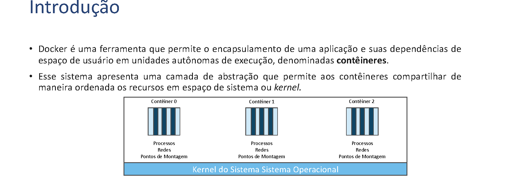
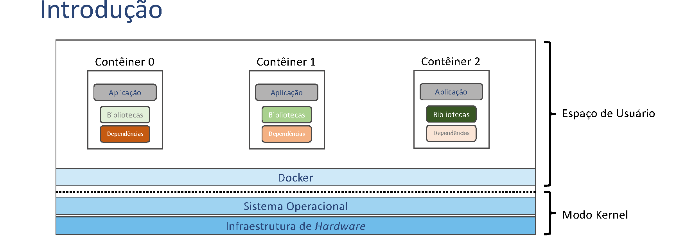
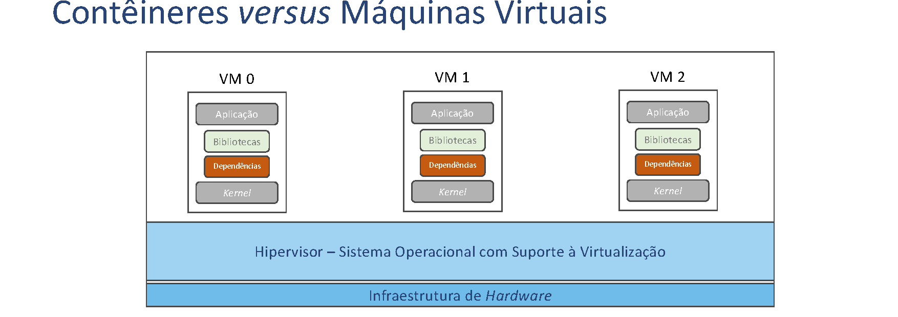
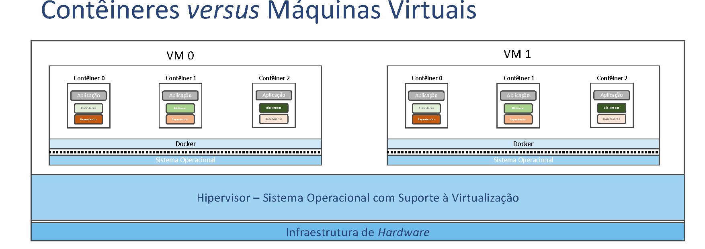
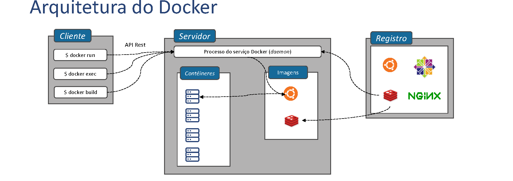

# Introdução ao Docker

## Introdução

- Docker é uma ferramenta que permite o encapsulamento de uma aplicação e suas dependências de espaço de usuário em unidades autônomas de execução, denominadas **contêineres**.
- Esse sistema apresenta uma camada de abstração que permite aos contêineres compartilhar de maneira ordenada os recursos em espaço de sistema ou *kernel*.



- Os contêineres são isolados entre si: os processos em execução em determinado contêiner não tem a visão do sistema de arquivos e do espaço de memória de outro contêiner.
- Além da segurança do isolamento, uma motivação para o desenvolvimento do Docker foi facilitar o gerenciamento de dependências e bibliotecas.
- Um mesmo servidor ou estação de trabalho pode executar contêineres com versões diferentes das mesmas bibliotecas ou até mesmo bibliotecas distintas.
- O sistema operacional nativo já permite instalar versões diferentes de bibliotecas, mas configuração de processos para utilizar bibliotecas diferentes é trabalhoso e propenso a erros.



## Contêineres *versus* Máquinas Virtuais

- Através de virtualização, é possível habilitar várias versões de sistema operacionais em execução no mesmo *hardware*.
- Máquinas virtuais (no inglês, *Virtual Machine* — VM) também permitem isolamento e gestão de dependências.
- Como cada máquina virtual tem uma cópia do *kernel*, um conjunto de VMs ocupa **mais espaço** do que um conjunto com o mesmo número de contêineres.
- A criação de VM envolve uma chamada de sistema, o que acarreta **sobrecarga**.
- O isolamento entre as VMs é **reforçado**.



É possível combinar as duas abordagens — máquinas virtuais hospedando contêineres Docker:



## Arquitetura do Docker



- O servidor ou estação de trabalho que hospeda as aplicações executa um processo que controla o ciclo de vida dos contêineres.
- O cliente utiliza uma ferramenta de linha de comando para interagir com o processo Docker, através de invocações de uma API REST.
- Contêineres são criados a partir de **imagens**:
  - Pacotes contendo aplicação e dependências.
  - São armazenadas em um registro, que pode ser público (*DockerHub*) ou privado.
  - O processo Docker recupera as imagens do registro para criar contêineres.
- O desenvolvedor pode utilizar várias imagens diferentes para compor sua solução.

## Instalação e Configuração do Docker

- Existem vários caminhos para instalar o Docker.
- Para o desenvolvedor, um caminho é instalar o *Docker Desktop* a partir de <https://www.docker.com/products/docker-desktop/>:
  - A instalação é direta no Windows.
  - Se o WSL estiver configurado, a integração é automática.
- Entretanto, vamos instalar por linha de comando em um sistema Ubuntu Linux.
- A instalação e configuração por linha de comando é importante para criação de *pipelines*.
- Instruções atualizadas: <https://docs.docker.com/engine/install/ubuntu/>

### Configurando o repositório

Primeiro configuramos a chave do repositório do Docker:

```bash
$ sudo apt-get update
$ sudo apt-get install ca-certificates curl
$ sudo install -m 0755 -d /etc/apt/keyrings
$ sudo curl -fsSL https://download.docker.com/linux/ubuntu/gpg -o /etc/apt/keyrings/docker.asc
$ sudo chmod a+r /etc/apt/keyrings/docker.asc
```

Em seguida, adicionamos os repositórios:

```bash
$ ARCH=$(dpkg --print-architecture)
$ VERSION=$(. /etc/os-release && echo "$VERSION_CODENAME")
$ APT_LINE="deb [arch=$ARCH signed-by=/etc/apt/keyrings/docker.asc] https://download.docker.com/linux/ubuntu $VERSION stable"
$ echo $APT_LINE | sudo tee /etc/apt/sources.list.d/docker.list
$ sudo apt update
```

### Instalando os pacotes

```bash
$ sudo apt-get install docker-ce docker-ce-cli containerd.io docker-buildx-plugin docker-compose-plugin
```

Executamos um contêiner de testes:

```bash
$ sudo docker run hello-world
```

Adicionamos o usuário ao grupo Docker:

```bash
$ sudo gpasswd -a ubuntu docker
```

Fazendo *login* novamente, poderá executar os comandos `docker` sem usar `sudo`:

```bash
$ docker run hello-world
```

## Conclusão

- Contêineres facilitam a gerência de dependências e bibliotecas.
- Contêineres apresentam sobrecarga menor do que máquinas virtuais.
- Docker é formado por um ambiente de execução (*daemon*), ferramenta de linha de comando e registro de imagens.
- Apesar de existirem diversas opções para executar contêineres, Docker ainda é a maneira mais popular para desenvolvedores criarem contêineres.
