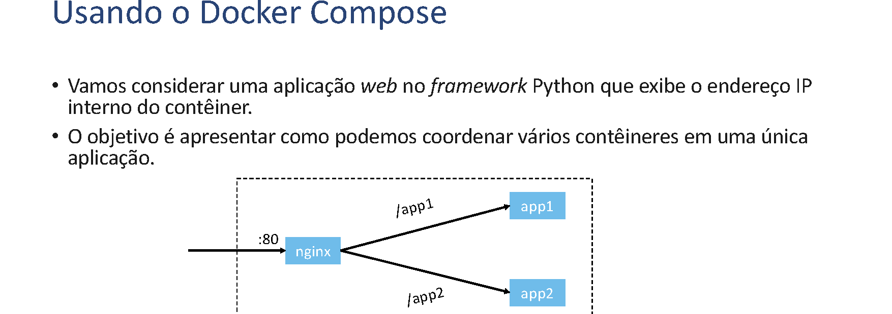

# Composição de Contêineres

## Tópicos

- Execução de contêineres.
- Remoção de contêineres e artefatos.
- Usando o *Docker Compose*.

## Execução de Contêineres

Principais parâmetros para `docker run`:

- `-it` permite que você interaja com o contêiner através de um terminal.
- `-d` executa em segundo plano, liberando o terminal.
- `--name` define o nome do contêiner.
- `-p <porta host>:<porta contêiner>` publica uma porta do contêiner para uma porta do *host*.
- `-v <caminho do host>:<caminho contêiner>` monta um diretório do *host* no contêiner.
- `--rm` remove o contêiner automaticamente após ele ser parado.

O parâmetro sem hifens é o nome da imagem. São várias opções, o comando pode ficar complexo — daí a motivação para usar *Docker Compose* mais adiante.

## Remoção de Contêineres e Artefatos

### Removendo um contêiner

```bash
ubuntu@devops:~$ docker ps --all
CONTAINER ID   IMAGE                     COMMAND        CREATED       STATUS                   PORTS   NAMES
d0522bee9620   jmhal/devops:v1           "python app.py"  12 days ago   Exited (0) 12 days ago           friendly_feynman
409333c1488c   meu-segundo-conteiner:v1  "python app.py"  13 days ago   Exited (0) 13 days ago           flamboyant_stonebraker
0acd261c402e   meu-primeiro-conteiner:v1 "/bin/bash"      13 days ago   Exited (0) 13 days ago           interesting_allen

ubuntu@devops:~$ docker rm friendly_feynman
friendly_feynman
```

- Você também pode remover usando o ID do contêiner.
- `docker stop friendly_feynman` interrompe o contêiner em execução, caso seja necessário.

### Removendo uma imagem

```bash
ubuntu@devops:~$ docker images
REPOSITORY               TAG    IMAGE ID       CREATED       SIZE
jmhal/devops             v1     b14bc674a6bc   13 days ago   68.2MB
meu-segundo-conteiner    v1     b14bc674a6bc   13 days ago   68.2MB
meu-primeiro-conteiner   v1     f8dd137fd9cd   2 weeks ago   141MB
meu-primeiro-conteiner   v2     db0ef674e1b5   2 weeks ago   141MB
ubuntu                   latest ffb64c9b7e8b   2 months ago  101MB

ubuntu@devops:~$ docker rmi jmhal/devops:v1
Untagged: jmhal/devops:v1
Untagged: jmhal/devops@sha256:2485b12f6ded8e21a8a6abd69dc8a0715b8a59a2869c1ea79cc0092450b200c4
```

- Primeiro remover todos os contêineres usando a imagem.
- Depois remover a imagem.

## Usando o *Docker Compose*

- Vamos considerar uma aplicação *web* no *framework* Python *Flask* que exibe o endereço IP interno do contêiner.
- O objetivo é apresentar como podemos coordenar vários contêineres em uma única aplicação.



### Dockerfile da aplicação

```dockerfile
FROM python:3.10-alpine

WORKDIR /app

RUN apk update && apk add gcc && apk add build-base && apk add linux-headers

COPY requirements.txt requirements.txt

RUN mkdir /app/showip

COPY __init__.py showip/__init__.py

COPY wsgi.py wsgi.py

RUN pip install -r requirements.txt

CMD [ "gunicorn", "--workers", "2", "--bind", "0.0.0.0", "wsgi:app" ]
```

### Construção e execução manual

```bash
ubuntu@devops:~/showip/app$ docker build -t showip:v1 .
[+] Building 24.1s (14/14)
FINISHED                                                                                  docker:default
...
sha256:6fcd9372e7192904b30ffba2c97fc5da24f194bf4ad9f6c36f8900d16c3ec34b                              0.0s
 => => naming to docker.io/library/showip:v1

ubuntu@devops:~/showip/app$ docker network create devops
65f4f5112173b5c672aa77b6319d760250c17f4a5a8f3bd9851b0c9ff193e22e

ubuntu@devops:~/showip/app$ docker run -d --name=app1 --network=devops showip:v1
3c3e19bda219ed6faf17b23531a25a0a157fce083953d24b925235578c38ced0

ubuntu@devops:~/showip/app$ docker run -d --name=app2 --network=devops showip:v1
81399cebd53a78cfbc906519dd23bb2596e1a8b6436a9d6c4954408e0acc4f1d
```

- Criamos uma rede interna, *devops*, para conectar os contêineres.
- Observe que nenhum dos contêineres de aplicação tem portas expostas.

### Subindo o *nginx* como *proxy* reverso

```bash
ubuntu@devops:~/showip/proxy-manual$ docker run -d -v ./default.conf:/etc/nginx/conf.d/default.conf -p 80:80 --network=devops nginx:latest
2440ad62d3eb1b18c2dd98793397d856c722c8f6906909793bd5cb133ef9fe47
```

- Vamos usar o *nginx* para servir de *proxy* reverso para os contêineres de aplicação.
- O arquivo `default.conf` é "montado" dentro do contêiner, substituindo a configuração original.
- O contêiner expõe a porta 80, mas também faz parte da rede *devops*.
- O *nginx* acessará os outros contêineres pelos nomes *app1* e *app2*.

### Configuração do *nginx*

```nginx
server {
    listen      80;
    listen [::]:80;
    server_name _;

    location / {
        root   /usr/share/nginx/html;
        index  index.html index.htm;
    }

    location /app1 {
        proxy_pass http://app1:8000/;
    }

    location /app2 {
        proxy_pass http://app2:8000/;
    }

    error_page   500 502 503 504  /50x.html;
    location = /50x.html {
        root   /usr/share/nginx/html;
    }
}
```

- O arquivo de configuração direciona as rotas `/app1` e `/app2` para os respectivos contêineres.
- A diretiva `proxy_pass` usa o nome dos contêineres, não os IPs da rede interna.
- O Docker tem um sistema de resolução de nomes interno a cada rede.
- Acessando <http://localhost/app1> ou <http://localhost/app2> (altere `localhost` para um IP se estiver usando máquina remota), você verá respostas diferentes para cada contêiner.

### Automatizando com `docker-compose.yml`

- Mostramos a criação manual da composição de contêineres.
- Entretanto, podemos descrever a arquitetura da aplicação em um arquivo chamado `docker-compose.yml`.
- Colocamos este arquivo em um diretório com os outros arquivos necessários, por exemplo, o `default.conf` do *nginx*.
- Comandos:
  - `docker compose up`: carrega os contêineres e outros recursos. Também aceita o parâmetro `-d`.
  - `docker compose down`: interrompe a aplicação.

Exemplo de `docker-compose.yml`:

```yaml
services:
  nginx:
    image: nginx:latest
    ports:
      - "80:80"
    volumes:
      - ./default.conf:/etc/nginx/conf.d/default.conf
    depends_on:
      - app1
      - app2
    networks:
      - devops

  app1:
    image: showip:latest
    networks:
      - devops

  app2:
    image: showip:latest
    networks:
      - devops

networks:
  devops:
```

- Arquivo no formato YAML.
- Dentro de `services`, listamos cada contêiner e suas opções de imagens, portas, volumes, redes, etc.
- Também listamos os recursos criados, como redes e volumes criados, se for o caso.

### Executando com *Docker Compose*

```bash
ubuntu@devops:~/showip/proxy-compose$ docker tag showip:v1 showip:latest
ubuntu@devops:~/showip/proxy-compose$ docker compose up -d
[+] Running 4/4
 ✓ Network proxy-compose_devops    Created                                  0.0s
 ✓ Container proxy-compose-app2-1  Started                                  0.2s
 ✓ Container proxy-compose-app1-1  Started                                  0.2s
 ✓ Container proxy-compose-nginx-1 Started                                  0.3s

ubuntu@devops:~/showip/proxy-compose$ docker compose ps
NAME                   IMAGE          COMMAND                  SERVICE  CREATED         STATUS         PORTS
proxy-compose-app1-1   showip:latest  "gunicorn --workers …"  app1     12 seconds ago  Up 11 seconds
proxy-compose-app2-1   showip:latest  "gunicorn --workers …"  app2     12 seconds ago  Up 11 seconds
proxy-compose-nginx-1  nginx:latest   "/docker-entrypoint.…"  nginx    12 seconds ago  Up 11 seconds  0.0.0.0:80->80/tcp, :::80->80/tcp

ubuntu@devops:~/showip/proxy-compose$ docker compose down
[+] Running 4/3
 ✓ Container proxy-compose-nginx-1 Removed                                 10.2s
 ✓ Container proxy-compose-app2-1  Removed                                  0.3s
 ✓ Container proxy-compose-app1-1  Removed                                  0.3s
 ✓ Network proxy-compose_devops    Removed                                  0.0s
```

- O *Docker Compose* facilita a criação e interrupção de vários contêineres em conjunto.

## Conclusão

- É possível controlar o ciclo de vida dos contêineres apenas utilizando os comandos do Docker.
- A medida que as aplicações se tornam complexas, esse processo é demorado e pode levar a erros como esquecer de apagar um recurso.
- O *Docker Compose* facilita a gestão de recursos dos contêineres.
- O arquivo `docker-compose.yml` pode ser colocado no controle de versão de código, servindo como documentação do progresso da arquitetura, além de permitir o retorno a versões estáveis da aplicação.
