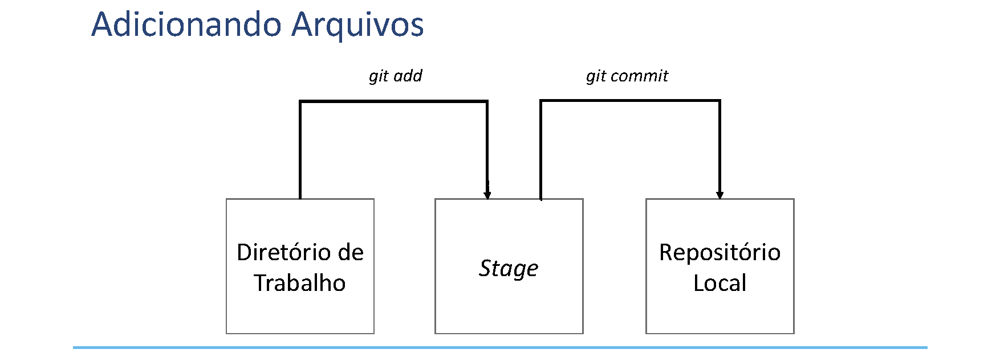
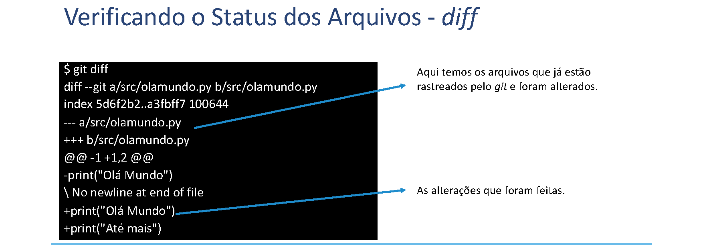
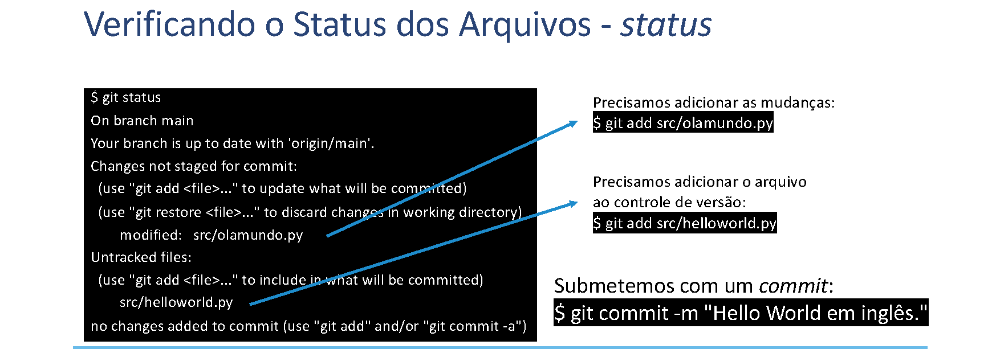
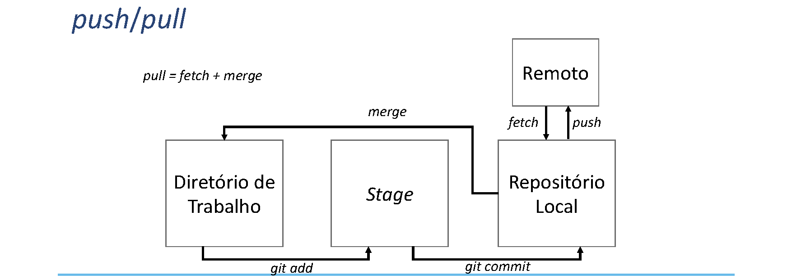

# Interagindo com a Ferramenta Git

## Iniciando um Repositório

- Na aula passada, mostramos como clonar um repositório do GitHub.
- Entretanto, podemos iniciar um repositório vazio local usando o comando *init*:
  - É criado um repositório local na pasta `.git` no diretório de execução do comando.
  - As alterações são feitas no diretório são registradas nessa pasta.
- Depois podemos vincular o repositório local a um repositório remoto usando o comando *remote*.
- Na prática, o comando *clone* é a aplicação de um *init* seguido de um *remote*.

```bash
$ git init
$ git remote add origin git@github.com:<usuario>/devops.git
```

## *Commits*

- *Commits* representam as alterações no estado dos arquivos na máquina local.
- Para agilidade no fluxo de trabalho, o recomendado é que o *commit* seja "pequeno":
  - Modificações pontuais que tratam de uma tarefa específica.
  - Se várias tarefas estão sendo modificadas, o ideal é dividir em vários *commits*.
- Um *commit* também armazena a data, o autor e uma mensagem de texto explicando o que foi alterado.
- O desenvolvedor submete um ou vários *commits* para o servidor remoto quando finaliza um período de trabalho.
- No servidor remoto, cada *commit* é identificado por um *hash* de 20 *bytes*.

## Adicionando Arquivos

Como exemplo da adição de arquivos e criação de um *commit*, considere a sequência de comandos abaixo dentro do repositório:

```bash
$ mkdir src
$ echo "print(\"Olá Mundo\")" > src/olamundo.py
$ git add src
$ git commit -m "Inserindo Olá mundo em Python."
```

- Os dois primeiros comandos criam o arquivo no diretório de trabalho local.
- O terceiro comando adiciona as alterações no *stage*, uma área intermediária temporária.
- O quarto comando cria o *commit* no repositório local.



- Todas alterações nos arquivos, mesmo esses já existam, devem ser adicionadas ao *stage* com `git add`.
- As remoções de arquivos são feitas através de `git rm` e também são registradas no *stage* para fazerem parte do próximo *commit*.
- Observe que todos os *commits* são registrados no repositório local.

## Verificando o Status dos Arquivos

Os seguintes comandos alteram o estado do repositório:

```bash
$ echo "print(\"Hello World\")" > src/helloworld.py
$ echo -e "\nprint(\"Até mais.\")" >> src/olamundo.py
```

A execução de `git status` apresenta a situação de cada arquivo:

- Arquivos no diretório de trabalho que foram alterados, mas não foram adicionados no *stage*.
- Arquivos no diretório de trabalho que não estão rastreados pelo *git*.
- Arquivos que estão no *stage*, mas não foram alvo de um *commit*.

### *diff* — comparando versões



```bash
$ git diff
diff --git a/src/olamundo.py b/src/olamundo.py
index 5d6f2b2..a3fbff7 100644
--- a/src/olamundo.py
+++ b/src/olamundo.py
@@ -1 +1,2 @@
-print("Olá Mundo")
\ No newline at end of file
+print("Olá Mundo")
+print("Até mais")
```

- Arquivos já rastreados pelo *git* e que foram alterados aparecem no diff.
- As linhas com `+` indicam o que foi adicionado; com `-`, o que foi removido.

### *status* — estado atual



```bash
$ git status
On branch main
Your branch is up to date with 'origin/main'.
Changes not staged for commit:
  (use "git add <file>..." to update what will be committed)
  (use "git restore <file>..." to discard changes in working directory)
        modified:   src/olamundo.py
Untracked files:
  (use "git add <file>..." to include in what will be committed)
        src/helloworld.py
no changes added to commit (use "git add" and/or "git commit -a")
```

Ações necessárias:

```bash
$ git add src/olamundo.py    # adicionar as mudanças ao stage
$ git add src/helloworld.py  # incluir o novo arquivo no controle de versão
$ git commit -m "Hello World em inglês."
```

## *push* / *pull*

- ***push*** submete todos os *commits* registrados no repositório local para o repositório no servidor remoto.
- ***pull*** recupera do servidor remoto os *commits* que outros desenvolvedores submeteram através de *push*:
  - Copia todos os *commits* mais recentes do servidor remoto para o repositório local usando a operação *fetch*.
  - Faz a fusão das alterações remotas com o repositório local usando a operação *merge*.
- Pode existir um **conflito**:
  - Você tenta submeter com *push* alterações em arquivos que outros desenvolvedores já alteraram.
  - Você recupera com *pull* alterações que foram feitas em arquivos que você também alterou localmente.



`pull = fetch + merge`

## Conflitos

- Ocorrem quando há uma divergência entre o repositório local e o servidor remoto.
- Dois desenvolvedores alteram o mesmo trecho de código.
- Para adicionar um colaborador ao repositório:
  - Na página do seu repositório no GitHub, clique em *Settings*.
  - No menu esquerdo, escolha *Collaborators*.
  - Clique em *Add people* e coloque o e-mail de um colaborador.
- É preciso entrar em acordo sobre a versão final e depois submetê-la ao repositório.

## Conclusão

- Mostramos como adicionar arquivos ao controle de versão.
- Ressaltamos de organizar as submissões em *commits* pequenos e concisos para facilitar a depuração.
- O *git* tem um sistema resolução de conflitos que permite revisar alterações e optar por mesclar (*merge*) trechos de códigos divergentes no mesmo arquivo.
- Entretanto, é necessário que os desenvolvedores possam prosseguir no seu planejamento sem ter que resolver conflitos em casa *commit*.
- Os *branches* (ramos) são uma opção para organizar tarefas diferentes em um mesmo projeto.
