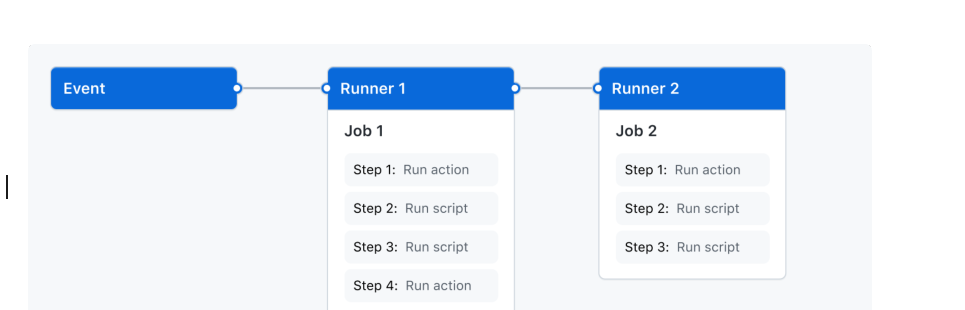
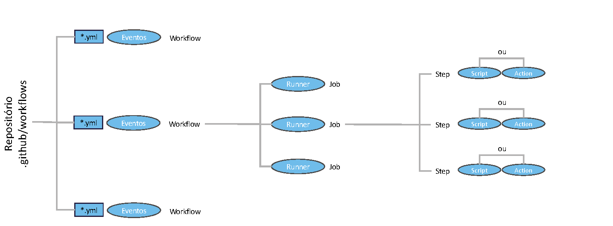

# Entendendo o GitHub Actions

## Introdução

- O *pipeline* de CI/CD é essencial para a implantação de um ambiente DevOps.
- Existem várias ferramentas para criação de ambiente de integração.
- O uso de servidores *on premises* envolve configuração de recursos e instalação de pacotes.
- Vamos aprender sobre um serviço de nuvem que já vem acoplado à ferramenta de controle de versão mais utilizada: o **GitHub Actions**.

## Visão Geral

- O GitHub Actions é uma ferramenta de CI/CD:
  - Automação de construção (*build*), testes e entrega.
  - O conceito de **Fluxo de Trabalho** (*workflow*) representa a execução de um *pipeline*.
  - Usa o *GitHub Flow*:
    - Criar fluxos de trabalho para cada *pull request*.
    - Implantar *pull requests* mesclados em produção.
    - Outros eventos também são suportados.
- O GitHub oferece máquinas virtuais para execução dos *pipelines*.
- Você também pode conectar infraestrutura *on premises* ao GitHub Actions.

## Componentes do GitHub Actions

- Um **Fluxo de Trabalho** é disparado por **eventos** (*events*) no repositório.
- Cada fluxo tem um ou mais **Trabalhos** (*jobs*) que são executados de forma serial ou paralela.
- Cada trabalho:
  - É executado em um **Executor** (*runner*), que pode ser uma máquina virtual ou contêiner.
  - Tem uma ou mais **etapas** que executam *scripts* ou **ações** (extensão reutilizável).

## Fluxos de Trabalho

- É um processo automatizado configurável que executará um ou mais *jobs*.
- Definido em um arquivo YAML inserido no repositório, no diretório `.github/workflows`.
- Podemos ter vários fluxos no diretório para executar tarefas como:
  - Criar e testar *pull requests*.
  - Implantar aplicações toda vez que forem criadas.
  - Adicionar *tags* ou rótulos sempre que um novo problema (*issue*) for aberto.
- É possível compor fluxos de trabalho para criar *pipelines* complexos.

## Eventos

- Um **evento** é uma atividade específica em um repositório que dispara a execução de um *workflow*.
- Exemplos:
  - Criação de *pull request*.
  - Abertura de *issue*.
  - *push*/*commit*.
- Também é possível executar por agendamento ou ativação de uma API REST, integrando o *workflow* a outros ambientes de automação.

## Trabalhos

- *Jobs* é um conjunto de etapas (*steps*) em um *workflow* executadas no mesmo *runner*.
- Cada etapa é um *script* ou ação, executadas em ordem.
- A execução dos *jobs* ocorre de acordo com uma relação:
  - **Padrão:** os *jobs* não têm dependência e podem ser executados em paralelo.
  - **Dependência:** um *job* precisa do resultado de outro para executar, sendo executados em série.
- Você pode configurar várias compilações em paralelo, uma para cada arquitetura.
- Cada empacotamento depende da compilação anterior.
- Como os *jobs* estão no mesmo *runner*, é fácil compartilhar dados e artefatos entre eles.

## Ações

- **Ações** (*actions*) são aplicativos já presentes no GitHub Actions para executar tarefas complexas, mas comuns à maioria dos *workflows*.
- Utilizar uma *action* evita criar mais código em *scripts*:
  - Extrair o repositório.
  - Configurar o conjunto de ferramentas (*toolchain*) para um *build*.
  - Autenticar o acesso a um provedor de nuvem.
- Você pode criar novas ações e registrá-las no *GitHub Marketplace*.

## Executores

- **Executores** ou *runners* é um servidor que executa os *workflows*.
- Cada *runner* só pode executar um *job* por vez.
- Sistemas operacionais:
  - Ubuntu Linux.
  - Windows.
  - macOS.
- Cada execução de *workflow* utiliza uma máquina virtual nova e recém-criada.
- Se precisar de alguma configuração específica de SO, pode usar *runners on premises*.

## Estrutura Geral

A figura a seguir resume a hierarquia: o repositório contém o diretório `.github/workflows` com arquivos `*.yml`; cada arquivo descreve um *workflow* disparado por eventos; cada *workflow* tem *jobs* executados em *runners*; cada *job* tem etapas (*steps*) que executam um *script* ou uma *action*.

## Limitações

- Se optar por usar os *runners* do GitHub, deve ter em mente:
  - São limitados por padrão; máquinas mais poderosas estão disponíveis mediante taxas.
  - Cada *runner* é inicializado do zero, por segurança, mas isso pode aumentar o tempo de *build*.
- Também por segurança, é necessário configurar o acesso aos *logs* de execução para limitar o compartilhamento de informações sensíveis (senhas, chaves de API, *tokens*).
- O GitHub Actions é focado em código; não tem o mesmo nível de recursos para gestão de infraestrutura que o Azure DevOps, por exemplo.
- Sua organização precisa de conexão de boa qualidade com a Internet.

## Conclusão

- O GitHub Actions permite a criação de *pipelines* CI/CD com os *workflows*.
- Sua versão gratuita é suficiente para aprendizado e testes.
- Para ambientes de produção e grandes equipes, há planos pagos.
- Usar *runners on premises* permite customização maior do ambiente de execução.
