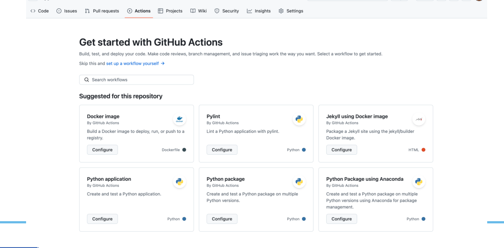

# Fluxos de Trabalho

## Introdução

- Vimos que a Integração Contínua exige *commits* frequentes:
  - Detecção de erros.
  - Facilitação de *merges*.
- Ao fazer *commit*, podemos continuamente compilar e testar o código em um servidor de Integração Contínua.
- Os **Fluxos de Trabalho** (*workflows*) habilitam a Integração Contínua no GitHub Actions.
- Ao analisar seu repositório, o GitHub Actions sugere **Modelos de Fluxos de Trabalho**:
  - Instalação de pacotes e testes comuns a uma linguagem específica.
  - Ações pré-definidas para implantação, criação de pacotes, etc.

Também podemos usar os Fluxos de Trabalho para Implantação Contínua:

- Podemos configurar a implantação para ocorrer quando o código for enviado para um *branch* específico.
- Definir um cronograma.
- Podemos conectar o GitHub Actions aos principais provedores de nuvem através do *OpenID Connect* (OIDC).
- As credenciais e informações sigilosas são controladas pelo ambiente, sem a necessidade de expô-las com frequência.

## Usando Modelos

- O GitHub oferece modelos de *workflows* pré-configurados:
  - <https://github.com/actions/starter-workflows>
  - O GitHub analisa o código em seu repositório e sugere um modelo adequado.
- Modelos disponíveis:
  - Integração Contínua (CI)
  - Implantações
  - Automação
  - Varredura de Código
  - Páginas Estáticas
- Por exemplo, na pasta `ci` do repositório acima, o arquivo `python-app.yml` define um *workflow* básico para aplicações Python.



## Criação de Fluxos de Trabalho

- Os *workflows* são definidos no diretório `.github/workflows` na raiz de seu repositório.
- No arquivo, precisam estar definidos os seguintes componentes básicos:
  - Um ou mais **eventos** que acionarão o fluxo de trabalho.
  - Um ou mais **trabalhos** (*jobs*):
    - Cada um será executado em um **executor** (*runner*).
    - Executa uma série de uma ou mais **etapas** (*tasks*).
- Lembrando que cada *task* pode ser um *script* ou uma ação pré-definida no GitHub Actions.

## Acionando um Fluxo de Trabalho

- Os eventos que acionam um *workflow* podem ser:
  - Eventos que ocorrem no repositório.
  - Eventos que ocorrem fora do GitHub e que disparam um evento `repository_dispatch` no GitHub.
  - Horários agendados.
  - Disparo manual.
- Exemplos:
  - Um *workflow* para executar quando um *push* é feito no *branch* padrão do seu repositório.
  - Na criação de uma versão.
  - Na abertura de um problema ou *issue*.

## Exemplo de Demonstração

```yaml
name: Demonstração do GitHub Actions
run-name: ${{ github.actor }} está testando GitHub Actions
on: [push]
jobs:
  Explore-GitHub-Actions:
    runs-on: ubuntu-latest
    steps:
      - run: echo "O trabalho foi disparado automaticamente pelo evento ${{ github.event_name }}."
      - run: echo "O trabalho está executando em servidor ${{ runner.os }} hospedado pelo GitHub!"
      - run: echo "O nome do branch é ${{ github.ref }} e o repositório é ${{ github.repository }}."
      - name: Recuperar Código do Repositório
        uses: actions/checkout@v4
      - run: echo "O código do repositório ${{ github.repository }} foi clonado para o executor."
      - run: echo "O fluxo de trabalho está pronto para testar o código."
      - name: Listar os arquivos no repositório.
        run: |
          ls ${{ github.workspace }}
      - run: echo "O status do trabalho é ${{ job.status }}."
```

- Devemos criar o arquivo `github-actions-demo.yml` no diretório `.github/workflows`.
- Você pode criar através da interface *web* do GitHub ou fazer um *commit* pela linha de comando ou IDE.
- Os detalhes da sintaxe serão apresentados em aula posterior.
- Por enquanto, só precisamos saber que `on: [push]` irá disparar a execução quando o *push* do *commit* com o arquivo for feito no repositório.

## Visualizando a Execução

- No GitHub, visite a página do seu repositório.
- Clique na opção **Actions** (Ações) no menu superior.
- Na barra lateral esquerda, clique no fluxo de trabalho que deseja exibir — no caso, "Demonstração do GitHub Actions".
- Na lista de execuções, clique no nome da execução que deseja ver. Teremos algo como "USUÁRIO está testando o GitHub Actions".
- Na barra lateral esquerda da página de execução, em **Jobs**, clique no trabalho `Explore-GitHub-Actions`.

## Recursos Avançados

- Armazenar segredos.
- Criar trabalhos dependentes.
- Usar uma matriz.
- Memorizar (*cache*) dependências.
- Usar banco de dados e contêineres de serviços.
- Usar etiquetas para encaminhar fluxos de trabalho.

## Conclusão

- *Workflows* permitem criar *pipelines* CI/CD usando GitHub Actions.
- Existem modelos preparados para construção e configuração de *pipelines* para as principais linguagens de programação.
- Podemos controlar a execução do *workflow* por eventos.
- Apesar de inicialmente simples e diretos, os fluxos de trabalho podem ser expandidos para criar configurações complexas.
